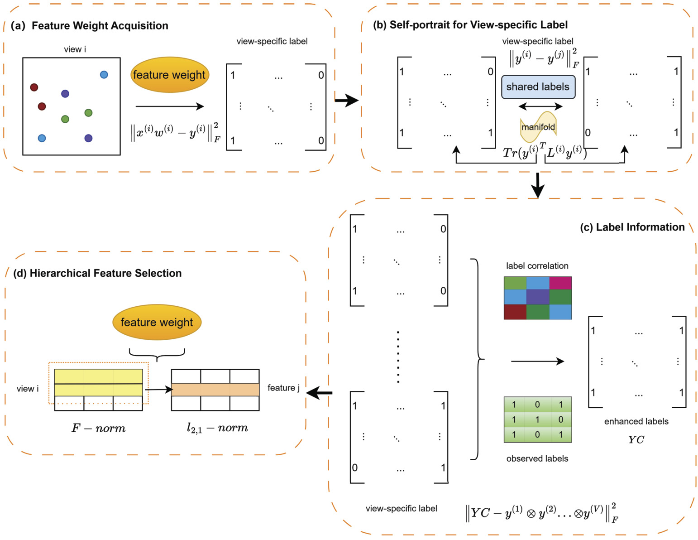
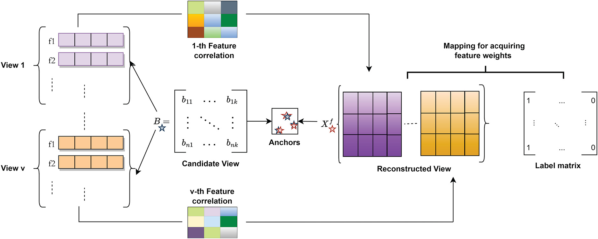
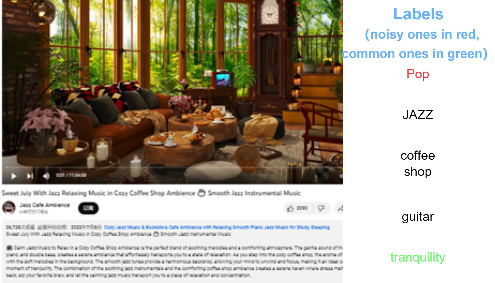
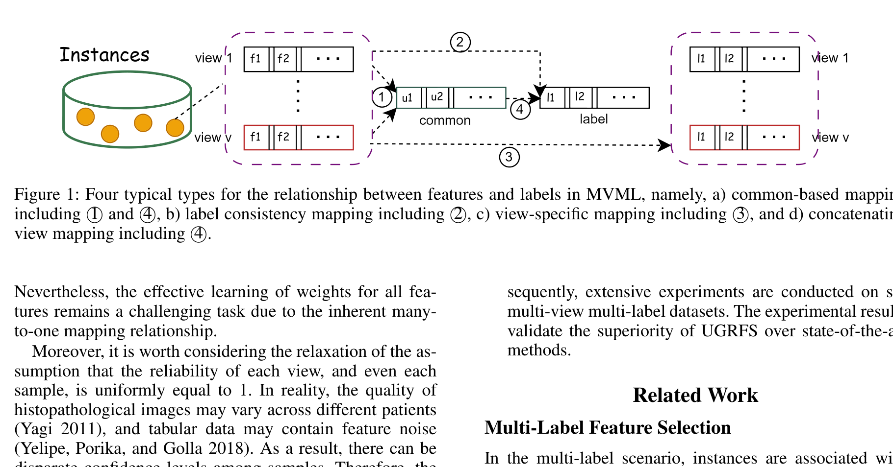
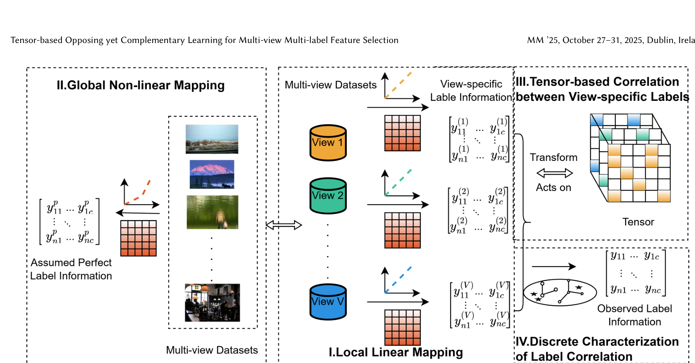
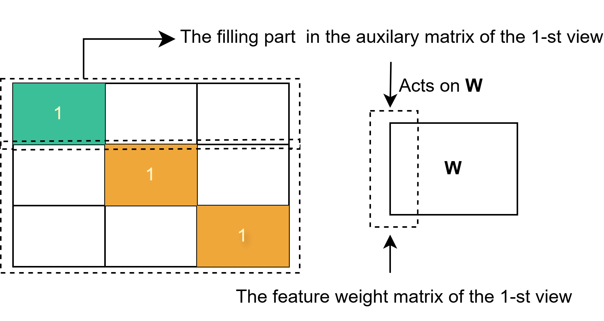

# 从六篇 MVML 论文的目标函数读懂方法与创新

## 1. 共性背景：这六篇究竟在做什么


| 词                               | 一句话                                                       | 典型例子                                                     |
| -------------------------------- | ------------------------------------------------------------ | ------------------------------------------------------------ |
| **多标签 (multi-label)**         | 一个样本**同时属于多个类**，输出是一个 0/1 向量而不是一个类别号 | 一张图同时有"沙滩/天空/人"；一篇论文同时属于"机器学习/图论"  |
| **多视图 (multi-view)**          | 同一个样本有**多组特征**，每组从不同角度描述它               | 一张图有 RGB 直方图 / GIST / 词袋；一篇文章有标题词袋 / 正文 TF-IDF / 引用网络 |
| **特征选择 (feature selection)** | 从 d 维里挑出 k 维（$k\ll d$），**只输出排序，不输出分类器** | 从 1312 维里挑 20% = 262 维，再交给下游分类器                |

叠起来就是本文档的主角：**MVML-FS = 在多视图多标签数据上给特征排序**。


### 1.1 三个共同矛盾

1. **共性与特性**：多个视图描述同一批样本，应当共享信息；但颜色特征能提供的线索，文本特征未必也有。强迫所有视图完全一致会丢掉互补信息。
2. **标签有用，也可能有错**：$Y$ 是监督信号，但实际标注可能包含误标和漏标。若完全相信 $Y$，错误会传给特征权重；若过度去噪，又可能删掉真的标签。
3. **选特征是离散决策，优化通常是连续的**：直接搜索全部特征子集代价太高，于是模型先学连续权重，用 $\ell_{2,1}$ 促使某些整行接近零，再取前 $k$ 个特征。


### 1.2 六篇方法的共同框架

六篇论文都要学出特征权重，但**目标函数不是同一个式子换参数**。下面只是一个读各篇论文公式的框架：

$$
\min_{\theta}\quad
\underbrace{\mathcal L_{\mathrm{fit}}(\theta)}_{\text{特征拟合标签或潜表示}}
+\sum_{k=1}^{K}\lambda_k
\underbrace{\mathcal R_k(\theta)}_{\text{视图、标签等结构约束}}
+\lambda_{\mathrm{fs}}
\underbrace{\Omega_{\mathrm{fs}}(\theta)}_{\text{促进特征选择}} .
$$

$\theta$ 代表该篇论文真正要学的变量；拟合部分可以不止一项。结构项的数量 $K$ 也不固定：图平滑、视图重构、标签分解和张量约束只是不同论文的选择。最后一项常含 $\ell_{2,1}$ 行稀疏，但 EF²FS 作用于 $A$，DHLI 同时作用于 $W$ 和 $U$，不能统一写成 $\delta\|W\|_{2,1}$。主拟合项前写系数 1 是常见的尺度约定，**不意味着六篇必须有相同数量或含义的平衡参数**。

谁在拟合谁？新学了什么变量？约束项希望它保留什么关系？最后用哪个矩阵给特征排序？这些问题都要到第二部分来讲解


### 1.3 经常出现的工具方法


**（1）平方误差：衡量两个矩阵有多接近**

 常见写法是 $\|A-B\|_F^2$，即把 $A$ 和 $B$ 对应位置的差逐一平方后相加。在这些论文里，它既可以要求“特征产生的预测接近标签”，也可以要求“某个视图能重构共享表示”。因此，看到这一项时先问：**谁在拟合谁？** 例如 I²VSLC 的 $\|x^{(i)}w^{(i)}-y^{(i)}\|_F^2$，拟合的是第 $i$ 个视图自己的潜标签，而不是直接拟合观测标签 $Y$。

**（2）图平滑：让关系密切的样本保留相近的表示** 

用 $S_{pq}$ 表示样本 $p,q$ 的相似度，$L=D_S-S$ 表示图拉普拉斯矩阵。当 $S$ 对称且非负时，对样本表示 $F$ 有
$$
\operatorname{Tr}(F^\top LF)
=\frac12\sum_{p,q}S_{pq}\|F_{p,:}-F_{q,:}\|_2^2.
$$
相似度越大，两个样本的表示差异受到的惩罚就越大。读图相关的式子，要分别看**图由什么信息建立、图约束哪个变量**：I²VSLC 用视图特征建图，约束该视图的潜标签；UGRFS 用标签建图，约束全局表示。EF²FS 借助图平滑能量计算视图权重，但最终目标里没有再加入同形式的独立图惩罚项。

**（3）$\ell_{2,1}$ 行稀疏：把特征权重变成排序依据** 

若权重矩阵 $W$ 的第 $j$ 行对应第 $j$ 个特征，则
$$
\|W\|_{2,1}=\sum_{j=1}^{d}\|W_{j,:}\|_2.
$$
这一项倾向于把作用较小的特征对应的一整行压小。训练后再计算每行的范数，按大小选前 $k$ 个特征。**但要核对被稀疏化和被排序的到底是哪个矩阵**：EF²FS 使用 $A$，DHLI 学习公共与特有两路权重后合并排序；加入 $\ell_{2,1}$ 也不保证结果恰好只有 $k$ 行非零。

**（4）交替优化：一次先更新一组变量** 

这些方法往往同时学习特征权重、潜在表示和其他辅助变量，通常固定其余变量，轮流更新其中一组；部分论文还使用乘性更新。这是**求解目标函数的方法**，不是目标函数中新增的惩罚项。目标值随迭代下降可以说明求解过程的表现，不能单凭这条曲线断言找到全局最优解。


### 1.4 共用实验口径

论文通常以五折交叉验证、1%—20% 的特征预算和 AP、Coverage、Hamming Loss、Ranking Loss 四项指标评估。

**七步实验流程**

```
1.数据集准备（多样本多标签，视图已切好）

2.5 折交叉验证拆分（训练 / 测试）

3.在【训练集】上跑特征选择模型 → 学到特征权重 w → 全特征降序排序

4.取 top-k 个特征（k 扫描 1% … 20% 的总特征数）

5.用这 k 个特征训练/预测多标签分类器

6.算 AP / Coverage / HL / RL 四项指标

7.对 20 个百分比点取均值，跨 5 折报 mean ± std
```

补充分析（各篇按需做，不属于主流程）：参数敏感性分析、消融实验、收敛性分析、Friedman 检验、复杂度分析


关于四项指标的方向一般为 **AP 越高越好，其余三项越低越好**：AP 看相关标签能否排在前面，Coverage 看要走到排序多深才能覆盖样本的相关标签，Hamming Loss 看逐标签判错比例，Ranking Loss 看相关标签与不相关标签的相对顺序错了多少。


---

## 2. 六篇论文：逐项读目标函数

### 2.1 I²VSLC（Information Sciences 2024）：标签空间也会"不一致"



*图：I²VSLC 的四个模块 —— (a) 特征权重获取、(b) 视图特有标签的自刻画、(c) 标签信息（相关矩阵→增强标签）、
(d) 层级特征选择。*

**问题动机**：同一批样本的不同视图，不一定都能解释同一组标签。I²VSLC 因而给每个视图一份可学习的标签矩阵，再约束它们既保留自身信息、又不完全分裂。

#### 目标函数

$$
\begin{aligned}
F_{I^2VSLC}=&\underbrace{\sum_{i}\big\|x^{(i)}w^{(i)}-y^{(i)}\big\|_F^2}_{\text{① 视图→自己的标签}}
+\alpha\underbrace{\Big(\sum_i\mathrm{Tr}(y^{(i)\top}L^{(i)}y^{(i)})+\sum_i\sum_{j\ne i}\|y^{(i)}-y^{(j)}\|_F^2\Big)}_{\text{② 自刻画函数 }\Phi(\cdot)}\\
&+\beta\underbrace{\big(\|YC-Y_{vs}\|_F^2+\|Y-YC\|_F^2\big)}_{\text{③ 增强标签去噪}}
+\gamma\underbrace{\sum_i\|w^{(i)}\|_F}_{\text{④ 视图级收缩}}
+\delta\underbrace{\|W\|_{2,1}}_{\text{⑤ 特征级行稀疏}}
\end{aligned}
$$

其中 $Y_{vs}=\mathbf 1[\sum_i y^{(i)}\ge1]$ 是各视图标签的 OR 聚合（注意论文显式定义 $\otimes$ 为 **OR** 而非 Kronecker 积）。

**自刻画函数 $\Phi(\cdot)$ 的两项各有讲究：**
$$
\Phi(\cdot)=\underbrace{\sum_{i=1}^{V}\mathrm{Tr}\big(y^{(i)\top}L^{(i)}y^{(i)}\big)}_{\text{intra-view：视图内流形平滑}}
+\underbrace{\sum_{i=1}^{V}\sum_{j\ne i}\big\|y^{(i)}-y^{(j)}\big\|_F^2}_{\text{inter-view：视图间共识}}
$$

**变量清单**

| 符号 | 维度 | 角色 |
|---|---|---|
| $y^{(i)}$ | $n\times l$ | **学习参数**：第 $i$ 个视图特有的标签 |
| $w^{(i)}$ | $d^{(i)}\times l$ | **学习参数**：视图自己的特征权重 |
| $W=\bigoplus_i w^{(i)}$ | $d\times l$ | 排序依据（纵向拼接） |
| $C$ | $l\times l$ | **学习参数**：标签相关矩阵（**全局共享**） |
| $Y_{vs}$ | $n\times l$ | **计算**：各视图标签的 OR |
| $L^{(i)}$ | $n\times n$ | 已知：视图 $i$ 的**特征** knn 图拉普拉斯 |


#### 我的理解：目标函数如何串起整个方法

**整体链路**：每个视图先学习自己能够解释的潜标签，再把这些标签汇总，与观测标签建立联系，最后从视图权重中选特征。这里的箭头表示信息关系，所有变量仍在同一目标中联合学习。

$$
X^{(i)}\xrightarrow{\;w^{(i)}\;}y^{(i)},\qquad
Y_{vs}=\bigvee_i y^{(i)}\ \longleftrightarrow\ YC\ \longleftrightarrow\ Y.
$$

1. **先允许各视图说出不同的标签。** $\|x^{(i)}w^{(i)}-y^{(i)}\|_F^2$ 让视图 $i$ 的特征预测自己的 $y^{(i)}$，而非要求所有视图直接预测同一个 $Y$。这使“某个标签主要由少数视图提供证据”可以被模型表达。为防止 $y^{(i)}$ 任意变化，图项 $\operatorname{Tr}(y^{(i)\top}L^{(i)}y^{(i)})$ 要求**该视图中特征相近的样本，潜标签也相近**；视图间的 $\|y^{(i)}-y^{(j)}\|_F^2$ 则防止各视图完全分裂。
2. **再把各视图接回观测监督。** $Y_{vs}$ 是视图潜标签的并集，$YC$ 是通过全局共享的标签相关矩阵 $C$ 得到的增强标签。$\|YC-Y_{vs}\|_F^2+\|Y-YC\|_F^2$ 同时连接“各视图推断”和“原始标注”，但没有强制 $Y_{vs}=Y$。因此，这里学的是受观测标签约束的潜标签，而不是给每个视图任意造一套标签。
3. **最后在两个粒度上压缩权重。** $\sum_i\|w^{(i)}\|_F$ 以整个视图为单位抑制弱视图，$\|W\|_{2,1}$ 以特征行为单位抑制弱特征，再用 $W$ 的行范数排序。我的理解是：模型同时判断“哪些视图值得信”和“这些视图中的哪些特征值得留”；它并非先选视图、再选特征的两阶段流程。

#### 

**创新点**：视图特有标签 $y^{(i)}$ 是待学变量；视图内图平滑与视图间一致性共同约束它；视图级与特征级两种稀疏粒度共同影响选择。

---

### 2.2 GRAFS（Information Sciences 2024）：全局视图是"学"出来的



*图：GRAFS 的整体流程 —— 各视图特征相关性 → 候选视图（锚点表达）→ 重构视图 → 标签映射得到特征权重。*

**问题动机**：把多视图特征直接拼接，并不等于理解了视图间关系。GRAFS 让全局视图成为待学习变量，并用锚点表示连接各视图。

#### 目标函数

论文总目标（原文式 14；这里将五类项标为 a—e，锚点重构项只计一次）：

$$
\begin{aligned}
L_{\rm GRAFS}={}&
\underbrace{\|X^fW-Y\|_F^2}_{(a)\ \text{全局视图预测标签}}
+\alpha\underbrace{\sum_i v_i\|X^{(i)}-BP^{(i)}\|_F^2}_{(b)\ \text{锚点重构各视图}}\\
&+\beta\underbrace{\left(
\|B-W^cA^cR^c\|_F^2+
\|X^f-W^cA^fR^f\|_F^2+
\|A^c-A^f\|_F^2\right)}_{(c)\ \text{双路径与软一致性}}\\
&+\gamma\underbrace{\sum_i v_i\|X^fD^{(i)}-X^{(i)}C^{(i)}\|_F^2}_{(d)\ \text{逐视图补充}}
+\delta\underbrace{\|W\|_{2,1}}_{(e)\ \text{特征稀疏}} .
\end{aligned}
$$

**变量清单**（$k$ = 锚点数，$k_1$ = 潜锚点维数，$d$ = 总特征数）

| 符号 | 维度 | 角色 |
|---|---|---|
| $B$ | $n\times k$ | **要学**：候选视图（锚点表达） |
| $X^f$ | $n\times d$ | **要学**：全局视图（潜变量） |
| $W$ | $d\times l$ | **要学**：全局视图上的特征权重 = **排序依据** |
| $W^c$ | $n\times k_1$ | **要学**：两条路径**共享**的簇成员矩阵 |
| $A^c,A^f$ | $k_1\times k_1$ | **要学**：两条路径各自的潜锚点 |
| $R^c$ / $R^f$ | $k_1\times k$ / $k_1\times d$ | **要学**：锚点→候选视图 / 锚点→全局视图 |
| $P^{(i)}$ | $k\times d^{(i)}$ | **要学**：用锚点重构第 $i$ 个视图 |
| $C^{(i)}$ | $d^{(i)}\times d^{(i)}$ | **要学**：视图内特征变换 |
| $D^{(i)}$ | $d\times d^{(i)}$ | **不更新**：把 $X^f$ 的列块切出来的选择矩阵 |
| $v_i$ | 标量 | **算出来**：视图权重 |

> ⚠️ **一处最容易搞错的维度**：全局视图 $X^f$ 是 $n\times d$（**与拼接后的特征同维**），**不是** $n\times k$。因为最终排序矩阵 $W$ 必须是 $d\times l$（$d$ 行才能给 $d$ 个特征排序），而 $X^fW$ 要等于 $n\times l$ 的 $Y$。只有 $B$（候选视图）是 $n\times k$，$k$ 是**锚点数**。


#### 我的理解：目标函数如何串起整个方法

**整体架构**可以看成两份相互牵制的潜表示：锚点表达 $B$ 负责汇集各视图的结构，全局视图 $X^f$ 负责把汇集后的信息用于标签预测和特征选择。两者都由数据约束，且在一个目标中一起更新；$X^f$ 不是预先拼好的输入。

$$
B\approx W^cA^cR^c,\qquad
X^f\approx W^cA^fR^f,\qquad A^c\approx A^f.
$$

1. **从各视图形成锚点表达。** $\sum_i v_i\|X^{(i)}-BP^{(i)}\|_F^2$ 要求同一份 $B$ 经不同的 $P^{(i)}$ 能重构各视图。这促使 $B$ 保留多个视图的信息；$v_i$ 决定各视图在重构中的影响。
2. **用双路径把 $B$ 与 $X^f$ 联系起来。** 两条分解路径共享样本侧的 $W^c$，但分别拥有 $A^c,A^f$；$\|A^c-A^f\|_F^2$ 只鼓励二者接近。我的理解是：**共享坐标**提供跨视图的共性，**软对齐**给候选视图与全局视图各自留出调整空间。这里没有强制两个表示完全相同。
3. **让全局视图既有监督意义，也保留原视图信息。** $\|X^fW-Y\|_F^2$ 把 $X^f$ 接到标签；$\|X^fD^{(i)}-X^{(i)}C^{(i)}\|_F^2$ 又要求它的第 $i$ 个特征块与该视图对应。$D^{(i)}$ 只是固定的取列矩阵。两端共同约束 $X^f$ 后，$\|W\|_{2,1}$ 才能把 $W$ 的行范数变成原始特征的排序。

**串起来看**：锚点重构负责“信息从哪里来”，双路径负责“不同表示怎样共享结构”，标签预测与逐视图对应负责“全局表示是否有用”。压缩可能有助于降噪，但不能仅凭这套结构断言噪声一定被去除。


**创新点**：全局视图 $X^f$ 由标签预测、锚点路径和逐视图还原三方共同决定；$W^c$ 共享而 $A^c,A^f$ 只作软对齐，给特有信息留了空间。

---

### 2.3 EF²FS（Pattern Recognition 2025）：融合不再是预处理


*图：论文的动机例子（论文 Fig.1 上半部分）—— 一个视频的多个视图（画面 / 标题 / 简介）给出
"Rain, Relaxing, Coffee shop" 这组标签。EF²FS 关心的是：**这些视图该怎么融合，融合与选择能不能一起做**。*

**问题动机**：先融合、后选特征的两步流程中，融合阶段不知道下游到底要哪些特征。EF²FS 把融合、公共表示和特征权重放进同一个目标函数。

#### 目标函数

$$
\min_{A,G,B,w^{(i)}}\;
\underbrace{\big\|X^fA-G\big\|_F^2}_{\text{① 融合→嵌入}}
+\alpha\underbrace{\big\|Y-GB^\top\big\|_F^2}_{\text{② 嵌入→标签}}
+\beta\underbrace{\sum_i\big\|x^{(i)}w^{(i)}-G\big\|_F^2}_{\text{③ 各视图→嵌入}}
+\gamma\underbrace{\sum_i\big\|a^{(i)}-w^{(i)}\big\|_F^2}_{\text{④ 全局块↔局部}}
+\delta\underbrace{\|A\|_{2,1}}_{\text{⑤ 行稀疏 → 排序}}
$$

$$
\text{s.t.}\quad G\ge0,\ B\ge0
$$

视图权重与融合矩阵（论文式(12)(9)，注意论文先给 $y$ 版（式(8)）再改成 $G$ 版）：

$$
c_i=\frac{1/\mathrm{Tr}\big(G^\top L^{(i)}G\big)}{\sum_{j=1}^{V}1/\mathrm{Tr}\big(G^\top L^{(j)}G\big)},
\qquad
X^f=\big[c_1x^{(1)},\,c_2x^{(2)},\,\cdots,\,c_Vx^{(V)}\big]
$$

**变量清单**

| 符号 | 维度 | 角色 |
|---|---|---|
| $x^{(i)}$ | $n\times d^{(i)}$ | 已知特征块 |
| $X^f$ | $n\times d$ | **算出来**：视图加权拼接 |
| $A$ | $d\times k$ | **要学**：融合后的特征权重 = **最终排序依据** |
| $G$ | $n\times k$ | **要学**：隐标签 / 公共嵌入（$k$ = 隐空间维数） |
| $B$ | $l\times k$ | **要学**：从嵌入 $G$ 回到标签的映射 |
| $w^{(i)}$ | $d^{(i)}\times k$ | **要学**：每个视图各自的局部投影 |
| $c_i$ | 标量 | **算出来**：视图权重 |

#### 我的理解：目标函数如何串起整个方法

**整体架构**围绕一个公共嵌入 $G$ 展开：加权融合后的特征和每个原始视图都要能生成 $G$，而 $G$ 又必须能解释观测标签。这样，融合、标签信息与特征权重在训练时会互相影响。

$$
X^f=[c_1x^{(1)},\ldots,c_Vx^{(V)}],\qquad
X^fA\approx G,\quad x^{(i)}w^{(i)}\approx G,\quad GB^\top\approx Y.
$$

1. **用 $G$ 汇合三种信息。** $\|X^fA-G\|_F^2$ 让融合特征产生公共嵌入；$\sum_i\|x^{(i)}w^{(i)}-G\|_F^2$ 让每个视图各自也能产生它；$\|Y-GB^\top\|_F^2$ 再保证 $G$ 与标签任务有关。$G$ 因而是连接各视图与监督信号的中间表示，不能仅因它维度较低就断言已经去噪。
2. **让融合权重受到当前表示的反馈。** 令 $E_i=\operatorname{Tr}(G^\top L^{(i)}G)$，论文按 $c_i\propto1/E_i$ 给视图加权：若 $G$ 在视图 $i$ 的图上更平滑，该视图的权重就更大。随后 $c_i$ 改变 $X^f$，$X^f$ 又影响 $A$ 和 $G$ 的更新，形成“**表示 → 视图权重 → 融合 → 表示**”的循环。$E_i$ 接近零时，实际计算还需要数值保护。
3. **把全局选择与局部选择对齐。** $A$ 的第 $i$ 个行块 $a^{(i)}$ 与局部投影 $w^{(i)}$ 通过 $\|a^{(i)}-w^{(i)}\|_F^2$ 相互约束，避免两套权重各说各话。最终 $\|A\|_{2,1}$ 压低弱特征的整行，并按 $A$ 的行范数排序；这里的输出是 $A$，不是各个 $w^{(i)}$ 的简单拼接。

**我的理解**：这篇的“嵌入式”体现在选特征的 $A$ 直接参与公共嵌入的学习，视图权重也随 $G$ 改变。要证明这种联合学习比固定融合后再选特征更好，还应做相同融合规则下的两阶段对照。


**创新点**：融合特征 $X^f$、公共嵌入 $G$ 和各视图投影在一个目标中相互影响；全局权重块 $a^{(i)}$ 与局部权重 $w^{(i)}$ 之间有显式一致性项。

---

### 2.4 DHLI（AAAI 2024）：把"噪声"变成一等变量



*图：论文的动机例子 —— 一个视频的"标签"里，绿色是公共标签，红色是噪声标签。
DHLI 的主张是：噪声不该被"启发式滤掉"，而该被显式求解出来。*

**问题动机**：观测标签可能混有公共信息、视图独有信息和错误标注。DHLI 把这三类标签显式分开，让去噪参与特征权重的学习。

#### 目标函数 

**第一层（标签矩阵层）**，Def.1；**第二层（视图层）**，Def.2：

$$
Y=\underbrace{Y_c}_{\text{公共}}\otimes\underbrace{Y_s}_{\text{视图特有}}\otimes\underbrace{Y_n}_{\text{噪声}}
$$

$Y_s$ 是总体的视图特有标签矩阵，由各视图的 $y_s^{(i)}$ 通过并集一致项约束；它不是把 $V$ 个矩阵简单横向拼接。

$$
\bigcirc_i y_s^{(i)}=\prod_i y_s^{(i)}=0\ \ (\text{AND，必须为 0}),
\qquad
\bigotimes_i y_s^{(i)}=Y_{tem}\approx Y_s\ \ (\text{OR，须等于 }Y_s)
$$

**完整目标（论文式(12)）：**

$$
\begin{aligned}
\min\;&\underbrace{\sum_{i=1}^{V}\big\|X^{(i)}W^{(i)}-Y_c\big\|_F^2}_{\text{各视图→公共标签}}
+\underbrace{\sum_{i=1}^{V}\big\|X^{(i)}U^{(i)}-y_s^{(i)}\big\|_F^2}_{\text{各视图→自己特有标签}}\\
&+\alpha\underbrace{\|Y\ominus Y_c\|_F^2}_{\text{公共占多数}}
+\beta\underbrace{\|Y_n\|_1}_{\text{噪声稀疏}}
+\gamma\big(\|W\|_{2,1}+\|U\|_{2,1}\big)\\
&+\delta\Big(\underbrace{\big\|\bigcirc_i y_s^{(i)}\big\|_F^2}_{\text{(f) 视图互斥}}
+\underbrace{\big\|\bigotimes_i y_s^{(i)}\ominus Y_s\big\|_F^2}_{\text{(g) 并集一致}}\Big)
\end{aligned}
$$

**四个算子清单**：

| 算子 | 名字 | 在 $\{0,1\}$ 上的实际计算 | 语义 |
|---|---|---|---|
| $\otimes$ | OR / 并集 | $\mathbf 1[\sum_i(\cdot)\ge1]$ | "至少一个视图说它是" |
| $\circ$、$\bigoplus$、$\prod$ | AND / 交集 | $\prod_i(\cdot)$ | "所有视图都说它是"（**全票通过**） |
| $\ominus$ | XOR | $\mathbf 1[a\ne b]$ | "不一致"指示器 → 惩罚项 |
| $\|\cdot\|_1$ | $\ell_1$ | $\sum_{pq}|(\cdot)_{pq}|$ | 稀疏 |


#### 我的理解：目标函数如何串起整个方法

**整体架构**是“先解释观测标签由哪些成分组成，再让特征分别预测这些成分”。$Y_c$ 表示跨视图公共部分，$y_s^{(i)}$ 表示视图 $i$ 特有部分，$Y_n$ 承担噪声；两套特征权重分别服务于公共和特有标签。

$$
Y=Y_c\otimes Y_s\otimes Y_n,\qquad
X^{(i)}W^{(i)}\approx Y_c,\quad X^{(i)}U^{(i)}\approx y_s^{(i)}.
$$

1. **两路预测对应“共性”和“互补性”。** 所有视图通过 $W^{(i)}$ 拟合同一个 $Y_c$，使公共标签有多视图证据；每个视图又通过 $U^{(i)}$ 拟合自己的 $y_s^{(i)}$，避免只学公共部分而忽略视图特长。这里不要求某个视图独自预测完整的观测标签 $Y$。
2. **标签分解需要约束，否则三类成分可以互相推卸。** $\|Y\ominus Y_c\|_F^2$ 倾向于让公共部分解释较多观测标签，$\|Y_n\|_1$ 倾向于让噪声只占少量位置；这两项体现的是建模先验。对特有部分，$\bigcirc_i y_s^{(i)}\approx0$ 防止“所有视图都称它为特有”，$\bigotimes_i y_s^{(i)}\approx Y_s$ 要求总体特有标签由各视图认领。这样，$Y_c,Y_s,Y_n$ 才各有角色。
3. **两路权重共同决定特征排序。** $\|W\|_{2,1}+\|U\|_{2,1}$ 同时压缩公共路和特有路的无关特征；最终要结合两路权重，不能只看 $W$。论文用组合后的行范数排序，仓库实现还分别归一化 $W,U$ 后再合并，复现时应明确采用哪一种口径。

**我的理解**：DHLI 真正改变的是“标签目标”而不只是增加一项去噪正则。若数据中的公共标签并不占多数，或噪声是成片出现的，分解质量就需要额外检验。


**创新点**：把标签噪声从模糊的“要去掉的东西”变成显式 $Y_n$；公共和特有标签分别由两套权重拟合；“全视图都特有”与“特有部分没人认领”由逻辑约束处理。

---

### 2.5 UGRFS（AAAI 2025）：同一视图里的样本也有质量差异



*图：论文归纳的 MVML 中特征–标签关系的四种典型范式（共识映射 / 标签一致映射 / 视图特有映射 / 拼接映射）——
UGRFS 的定位是"这四者之外"。*

**问题动机**：即使在同一个视图里，不同样本也未必同样可靠。UGRFS 学习样本级置信系数，并让它与全局视图重构共同影响特征排序。

#### 目标函数

$$
\begin{aligned}
\min_{W^{(i)},C^{(i)},W_y^{(i)}}\quad
&\sum_{i=1}^{V}\big\|\mathrm{diag}(C^{(i)})X^{(i)}W^{(i)}-Y\big\|_F^2
+\alpha\,\mathrm{Tr}\big(D^\top L_YD\big)\\
&+\beta\sum_{i=1}^{V}\big\|D^{(i)}-\mathrm{diag}(C^{(i)})X^{(i)}\big\|_F^2
+\gamma\big\|D-X^f\big\|_F^2
+\delta\|W\|_{2,1}
\end{aligned}
$$

其中 $D=Y_xW_y$ 是**学出来的全局视图分布**，$Y_x=[\rho(Y),J_1]\in\mathbb{R}^{n\times(n+1)}$，
$X^f=[v_1X^{(1)},\dots,v_VX^{(V)}]$ 是传统的视图加权拼接。

**变量清单**

| 符号 | 维度 | 角色 |
|---|---|---|
| $W^{(i)}$ | $d^{(i)}\times l$ | **要学**：每个视图自己的特征权重 |
| $W=\bigoplus_i W^{(i)}$ | $d\times l$ | 排序依据：**纵向拼接**后的整体权重 |
| $C^{(i)}$ | $n$（对角） | **要学**：**样本级置信度** |
| $D$（**全局视图分布**） | $n\times d$ | **要学**：学出来的全局视图 |
| $D^{(i)}$ | $n\times d^{(i)}$ | **要学**：$D$ 在第 $i$ 个视图上的分量 |
| $W_y^{(i)}$ | $(n{+}1)\times d^{(i)}$ | **要学**：从标签核空间回归出全局视图的系数 |
| $v_i$ | 标量 | **算出来**：视图权重 |


#### 我的理解：目标函数如何串起整个方法

**整体架构**有两条相连的线：各视图用特征权重 $W^{(i)}$ 预测标签；模型另学一个全局表示 $D$，使它既受标签关系引导，又能对应回各视图。每个视图中的每个样本还有自己的置信系数 $C^{(i)}$，它同时进入这两条线。

$$
\operatorname{diag}(C^{(i)})X^{(i)}W^{(i)}\approx Y,qquad
D^{(i)}\approx\operatorname{diag}(C^{(i)})X^{(i)},\qquad D\approx X^f.
$$

1. **让样本可靠性参与标签预测。** 第 $i$ 个视图的第 $m$ 个样本先乘 $c_m^{(i)}$，再通过 $W^{(i)}$ 产生预测；因此同一视图的样本不必被同等对待。但这一项是 $\|\operatorname{diag}(C^{(i)})X^{(i)}W^{(i)}-Y\|_F^2$，**缩放的是特征和预测，不是把整行残差乘上置信度**。所以“$C^{(i)}$ 学到了可靠性”仍是需要实验检验的解释。
2. **给全局表示两个参照。** $D=Y_xW_y$ 使 $D$ 可以由标签核表示生成，$\operatorname{Tr}(D^\top L_YD)$ 进一步要求标签相近的样本在 $D$ 中也相近；这里的图建在标签上。另一方面，$\|D-X^f\|_F^2$ 使 $D$ 接近视图加权拼接的 $X^f$，$\sum_i\|D^{(i)}-\operatorname{diag}(C^{(i)})X^{(i)}\|_F^2$ 让它的各个视图分量对应置信度调整后的原始特征。这样 $D$ 同时受标签结构和特征信息约束。
3. **两条线通过 $C^{(i)}$ 相互影响。** 改变样本置信度，会同时改变该样本的标签预测及其对全局视图的对应关系；更新 $D$ 和 $W^{(i)}$ 又会反过来改变适合的 $C^{(i)}$。最后把各 $W^{(i)}$ 纵向拼成 $W$，用 $\|W\|_{2,1}$ 及其行范数完成特征排序。

**我的理解**：UGRFS 把“哪个视图重要”细化到“这个视图里的哪个样本可信”。但置信系数的数学作用是预测缩放，是否真能识别脏样本，应通过可控噪声实验验证。


**创新点**：把可靠性细化到每个视图的每个样本；置信系数同时进入预测与全局视图的视图分量重构，使可靠性和表示互相影响。

---

### 2.6 TOCL（ACM MM 2025）：把标签诱导的样本关系堆成张量



*图：TOCL 的四个组件 —— I 局部线性映射、II 全局非线性映射、III 视图特有标签间的张量相关、IV 离散标签相关。*

**问题动机**：两两标签一致性未必能表达多个视图同时存在的关系。TOCL 把各视图标签诱导的样本关系堆成张量，并并行使用线性和非线性映射。

#### 目标函数

TOCL 把五个组件拼成一个目标（论文式(14)）：

$$
\begin{aligned}
\min_{y_t^{(i)},P,W,U,V,Y_n,T}\quad
&\underbrace{\sum_{i=1}^{V}\big\|PX^{(i)}A^{(i)}W-y_t^{(i)}\big\|_F^2
+\|Z-T\|_F^2+\tau\|T\|_*}_{\text{实例级映射 + 张量约束}}\\[4pt]
&+\underbrace{\alpha\Big\|PXW-\tfrac{I}{I+e^{-XV}}U\Big\|_F^2+\|U\|_F^2+\|V\|_F^2}_{\text{全局非线性映射}}\\[4pt]
&+\underbrace{\beta\|P\|_F^2}_{\text{限制 }P}+\underbrace{\gamma\big(\|(Y_{all}\otimes Y_n)\ominus Y\|_F^2+\|Y_n\|_F^2\big)}_{\text{离散标签相关 (IV)}}
+\underbrace{\delta\|W\|_{2,1}}_{\text{行稀疏 → 排序}}
\end{aligned}
$$

两个配套定义（Def.3 / Def.4，注意 TOCL 的 $\otimes$ 是**逐元素 OR**）：

$$
Y=Y_{all}\otimes Y_n,\qquad
Y_{all}=y_t^{(1)}\otimes y_t^{(2)}\otimes\cdots\otimes y_t^{(V)}
$$

张量怎么造：第 $i$ 个视图的潜标签可形成一个 $n\times n$ 的**样本关系矩阵**，沿视图维堆叠后得到三阶张量：

$$
T_{:,i,:}=y_t^{(i)}y_t^{(i)\top}\in\mathbb{R}^{n\times n}
\quad\Longrightarrow\quad T\in\mathbb{R}^{n\times V\times n}
$$

**变量清单**

| 符号 | 维度 | 角色 |
|---|---|---|
| $W$ | $d\times l$ | **要学**：全局特征权重 = **最终排序依据** |
| $A^{(i)}$ | $d^{(i)}\times d$ | **不更新**：把 $W$ 的对应行块"取出来"的 0/1 选择矩阵 |
| $P$ | $n\times n$ | **要学**：两路映射的耦合器 |
| $y_t^{(i)}$ | $n\times l$ | **要学**：第 $i$ 个视图的视图特有标签 |
| $U$ | $k\times l$，$k=\lfloor0.8l\rfloor$ | **要学**：隐标签关联矩阵 |
| $V$ | $d\times k$ | **要学**：非线性映射的投影系数 |
| $T$ / $Z$ | $n\times V\times n$ | $T$ 由潜标签诱导并受核范数约束；$Z$ 是与它匹配的辅助张量 |
| $Y_n$ | $n\times l$ | **要学**：显式噪声标签 |


#### 我的理解：目标函数如何串起整个方法

**整体架构**可以从“标签怎样约束特征权重”来读：观测标签 $Y$ 约束各视图的潜标签 $y_t^{(i)}$；潜标签分别约束对应视图的线性预测，并共同生成一个跨视图关系张量；全局非线性分支再与线性分支保持一致。最终，所有视图共用的 $W$ 给特征排序。

$$
Y_{all}=\bigotimes_i y_t^{(i)},\quad Y_{all}\otimes Y_n\approx Y,
\qquad PX^{(i)}A^{(i)}W\approx y_t^{(i)}.
$$

1. **局部线性分支保留视图特有的预测目标。** 每个视图用自己的 $X^{(i)}$ 拟合自己的 $y_t^{(i)}$，但通过固定的取块矩阵 $A^{(i)}$ 共用一份全局 $W$。因此“标签目标因视图而异”和“特征排序在全局统一”可以同时存在。$P\in\mathbb R^{n\times n}$ 在样本方向做混合，并由 $\beta\|P\|_F^2$ 限制幅度；不能把它简单当作对角的逐样本权重。

   

   *图：$A^{(i)}$ 从全局 $W$ 中取出视图 $i$ 对应的行块。*

2. **张量分支约束不同视图的样本关系。** 每个 $y_t^{(i)}y_t^{(i)\top}$ 表示由该视图潜标签诱导的样本间关系，沿视图维堆成 $T\in\mathbb R^{n\times V\times n}$。$\|Z-T\|_F^2+\tau\|T\|_*$ 让关系张量与辅助张量 $Z$ 保持接近，并用张量核范数鼓励较简单的跨视图关系结构。这比逐视图单独约束关系多了一层跨视图联系，但收益与计算代价仍要通过实验比较。
3. **全局非线性分支提供另一种映射形式。** $\|PXW-\sigma(XV)U\|_F^2$ 让线性预测与 sigmoid 分支的输出接近，$\|U\|_F^2+\|V\|_F^2$ 控制其参数规模。$U,V$ 没有直接拟合 $Y$，主要通过与线性分支一致来接受监督；所以“非线性带来了独立信息”仍需消融实验支持。
4. **标签约束把以上分支接回真实标注。** $Y_{all}$ 是各视图潜标签的 OR 聚合，$\|(Y_{all}\otimes Y_n)\ominus Y\|_F^2$ 要求它与噪声变量共同解释 $Y$；$\|Y_n\|_F^2$ 控制噪声变量大小，并非 $\ell_1$ 稀疏。最后 $\|W\|_{2,1}$ 压低无关特征的权重行，按 $\|W_{j,:}\|_2$ 排序。

**我的理解**：TOCL 的各模块最终都围绕 $y_t^{(i)}$ 与共享 $W$ 相互作用；张量约束负责跨视图关系，双映射负责表达形式，离散标签项负责把潜标签拉回观测监督。


**创新点**：局部线性映射与全局非线性映射互相约束；各视图标签诱导的样本关系被堆为张量，再用低秩约束捕捉跨视图结构；最终仍用共享的 $W$ 排序。

---

## 3. 跨篇比较：各自放松了什么假设

| 方法 | 重点改动 | 最终排序依据 
|---|---|---|
| I²VSLC | 每视图标签 $Y^{(i)}$ | 拼接后的 $W$ 行范数 |
| GRAFS | 锚点引导的全局视图 $X^f$ | 全局 $W$ 行范数 |
| EF²FS | 融合与特征选择联合优化 | $A$ 行范数 |
| DHLI | 公共、特有、噪声标签分解 | 公共与特有两路权重 |
| UGRFS | 样本级置信度与全局视图 | 拼接后的 $W$ 行范数 |
| TOCL | 标签诱导样本关系张量、线性与非线性双路 | 全局 $W$ 行范数 |


---

## 4. 梳理六篇算法后的启发

### 4.1 我学到的读论文方法

**先找假设，再看它怎样进入式子。** 例如 I²VSLC 放松“每个视图的标签一样”，对应新变量 $y^{(i)}$；GRAFS 放松“全局视图只能拼接”，对应待学的 $X^f$；UGRFS 放松“同一视图中每个样本一样可靠”，对应 $C^{(i)}$。变量出现以后，还必须有约束让它不任意漂移：I²VSLC 用共识和观测标签，GRAFS 用原视图重构和标签预测，UGRFS 用全局视图的一致性。这样读，比背四个超参数叫什么更可靠。

**每一个新增变量都对应一个新的验证责任。** 若声称学到“视图特有标签”，应展示它与公共标签有什么不同；若声称学到“样本置信度”，应展示低质量样本确实得到低置信；若声称张量捕捉高阶关系，应比较简单低秩替代项。只报告最终 AP 上升，很难知道是哪一项起作用。

**论文中的优化式、代码中的更新和最终指标是三层证据。** 目标函数说明作者希望模型做什么；更新式决定代码实际上在做什么；下游指标只说明某套实验流程的结果。三层若不一致，不能拿最末端的分数替前两层作证明。例如本仓库的若干复现实现与论文在图或变量参数化上有差别，应当以原文解释论文、以运行记录说明代码。


### 4.2 从六篇中浮现的三个研究问题

**问题 A：统一的视图权重是否过粗？** GRAFS、EF²FS 等方法都在某种程度上给一个视图整体分配权重，但一个视图对标签“天空”有用，并不意味着它对标签“奔跑”也有用。我的想法是把视图权重从 $v_i$ 扩为标签条件权重 $r_{i,q}$：第 $i$ 个视图对第 $q$ 个标签有多可靠。这不是简单多加一张矩阵；若没有归一化、稀疏或可辨识约束，它可能只会过拟合。因此第一步应先做可控数据检验，而不是直接堆复杂模型。

**问题 B：图权重对数据尺度是否稳定？** 多篇工作依赖图能量 $\operatorname{Tr}(G^\top L^{(i)}G)$。图的构造、特征缩放和热核带宽都可能改变该量。这里不能只根据一个代数式就宣称“所有视图权重会塌缩”；尤其对所有视图共享的 $G$ 同乘一个常数时，归一化后的 $1/E_i$ 权重并不会因此改变。真正要检验的是**各视图特征尺度、图构造参数和数值精度**改变后的稳定性。这个问题适合设计小规模、可重复的实验。

**问题 C：复杂结构带来的收益是否抵得上代价？** GRAFS 要学多组锚点与分解矩阵，TOCL 要做张量运算。复杂结构可能带来表达能力，但也增加超参数、内存和运行时间。比较时应在相同划分和特征预算下，同时报告指标、方差、耗时和解释性；否则“模型更复杂”容易被误读为“模型更好”。

