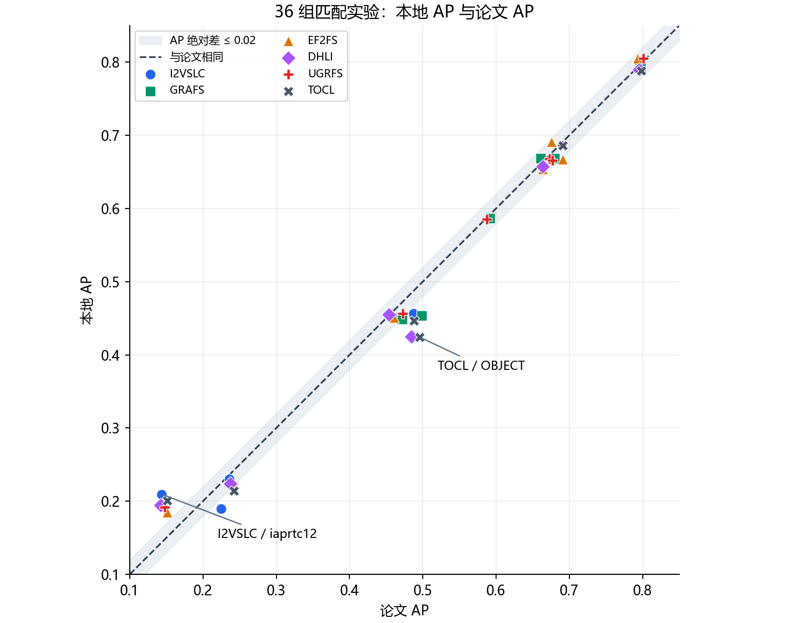
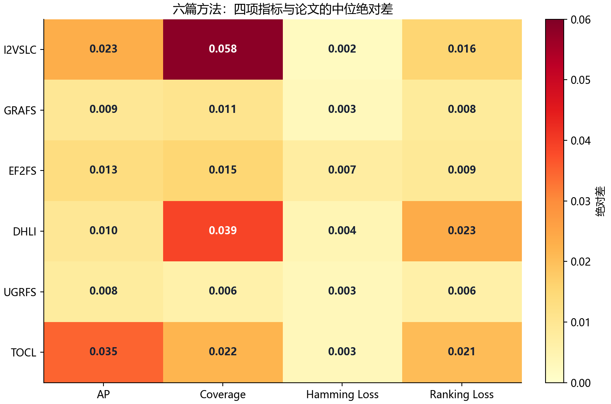
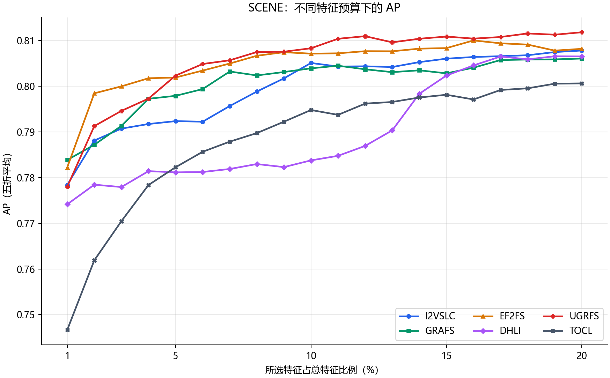

# 六篇 MVML-FS 算法：代码结构与实验复现结果

> **阅读范围**：本文解读当前仓库的六个特征选择实现，并分析 `results/` 中截至 2026-09-22 的实验结果快照。本文没有重新训练模型。文中的“本地结果”指该快照中的运行结果，并非六篇论文作者的原始数值。
>
> **一句话结论**：六种方法均已跑通，各论文对应的 6 个数据集共 **36/36 组结果齐全**；但仅 **7/36 组**的 AP、Coverage、Hamming Loss、Ranking Loss 四项指标与论文值**同时**相差不超过 0.01。因此可以说“完成了代码运行和初步数值对照”，不能说“六篇论文的实验结果均被严格复现”。

## 1. 先认识这套代码

这六篇论文解决的是同一类任务：输入同一批样本的多个视图特征 $X^{(1)},\ldots,X^{(V)}$ 和多标签矩阵 $Y$，输出**原始特征的重要性排序**。下游分类器只负责检验所选特征是否有用，不是六个特征选择算法本身。


| 阅读顺序 | 文件或函数 | 在流程中的作用 |
|---|---|---|
| 1 | [`main.py`](../main.py) 的 `DATASETS`、`ALGORITHMS`、`DEFAULT_PARAMS` | 登记数据集、六个入口函数及默认参数；EF2FS 另需 `V_dim=30`，GRAFS 另需 `kk=20`。 |
| 2 | `main.py::get_data`、`split_data_fold`、`run_one` | 读取 `.mat`，建立五个测试折；每折只在训练数据上调用特征选择算法。 |
| 3 | [`alg/`](../alg) 中对应的 `.py` 与 [`alg/_util.py`](../alg/_util.py) | 交替更新潜标签、视图表示和特征权重，返回 `record['idx']`，即完整特征排序。 |
| 4 | `main.py::evaluate_ranking`、`_make_mlknn` | 对 $k=1,2,\ldots,\lfloor0.2d\rfloor$，用排序前 $k$ 个特征训练 MLkNN，再在测试折计算指标。 |
| 5 | `main.py::build_summary`、`save_run` | 写出逐特征数曲线、逐折曲线、特征排序及汇总 CSV。 |
| 6 | [`paper_table.py`](../paper_table.py)、[`validate_results.py`](../validate_results.py) | 读取汇总值，与论文表格比较，并检查每组结果文件是否完整。 |

### 1.1 一个容易误读的数值口径

`summary_all.csv` 同时有 `AP_best` 和 `AP_paper_mean`。前者是在本地平均曲线上**挑一个最好的特征数**；后者先在每折取 1%—20% 特征比例对应的 20 个点，再求平均，最后跨 5 折汇总。本文对照论文时使用的是后者，而不是挑出的最好点。Coverage 使用 `CV_paper_mean_norm`，即原始 Coverage 除以该数据集的标签数。

可把汇总过程记成：

$$
\bar m_f=\frac1{20}\sum_{p=1}^{20}m_{f,k(p)},\qquad
\bar m=\frac1{5}\sum_{f=1}^{5}\bar m_f,
\quad k(p)\approx\operatorname{round}(pd/100).
$$

其中 $f$ 是折号，$p$ 是特征比例，$d$ 是总特征数。五折的标准差由五个 $\bar m_f$ 计算。**论文是否完全采用同一聚合方式并不都写清楚**：现有核对记录指出，六篇都报告 1%—20% 特征范围和五折结果，但只有 GRAFS 明确写了对所有采样点求均值。这是数值对照的一项限制。

`results/rankings_<算法>_<数据集>.csv` 保存的是一次运行中**首个有效折**的完整排序；`metrics_` 与 `perfold_` 则来自五折各自学到的排序。不能把那个单独的 `rankings_` 文件误当作五折共用的一份排序。代码另外计算了 Zero-one Loss（ZL），但下文论文对照只用 AP、Coverage、HL、RL 四项。

### 1.2 五折实验采用了什么设置

| 项目 | 本轮实际设置 | 读结果时的含义 |
|---|---|---|
| 划分 | 共享随机排列，5 个不重叠测试折；`--shuffle --seed 100` | 各折测试样本不重复；每折重新学特征排序。 |
| 特征预算 | 前 1%—20%，上限 `--select-ratio 0.2` | 图 3 横轴是所选特征占总特征的比例。 |
| 下游分类器 | MLkNN，`k=10, s=1.0` | 这是仓库的评测选择；六篇论文没有明确给出完全相同的分类器设置。 |
| 参数 | 六个方法的 `alpha=beta=gamma=lamb=1.0` | 本轮没有做论文所述的 $10^{-3}$ 到 $10^3$ 网格搜索。 |
| 输出 | `summary_all.csv`、每组的 `metrics_` / `perfold_` / `rankings_` | 本轮只复盘已有 CSV，没有重新执行训练。 |

完整协议与运行记录见 [`EXPERIMENT_PROTOCOLS.md`](../analysis/EXPERIMENT_PROTOCOLS.md) 和 [`REPRODUCE_ALL_SIX.md`](../analysis/REPRODUCE_ALL_SIX.md)。

## 2. 六个算法在代码里各做了什么

下面抓每个实现的**输入如何变成排序**，以及理解实验结果时最需要留意的一处代码与论文差异。完整逐行解读在 [`CODE_WALKTHROUGH.md`](../analysis/CODE_WALKTHROUGH.md)，公式与代码偏差在 [`PAPER_METHOD_ANALYSIS.md`](../analysis/PAPER_METHOD_ANALYSIS.md) 第 5.2 节。

### 2.1 I²VSLC：每个视图学习自己的潜标签

入口是 [`alg/I2VSLC.py`](../alg/I2VSLC.py) 的 `I2VSLC`。代码先按 `x_view` 切分特征，为每个视图建立图、潜标签 `y[i]` 和权重 `w[i]`；迭代时还更新共享的标签相关矩阵。直观链路是 $X^{(i)}\to y^{(i)}\to$ 视图潜标签并集，再由观测 $Y$ 约束；最后纵向拼接各视图权重，按行范数排序。

**实现注意**：当前代码每轮会把潜标签硬二值化；视图间差异项的两个有符号量也被处理成相同的 0/1 掩码。这与论文连续更新的写法有差异，结果接近不能自动证明每一步都严格实现了论文目标。

### 2.2 GRAFS：锚点表达与全局视图一起学习

入口是 [`alg/GRAFS.py`](../alg/GRAFS.py) 的 `view6`。代码用候选视图 `B` 重构各视图，并学习全局视图 `X1`；两条分解路径共享样本侧表示。`X1 @ W` 用来预测标签，最终对 `W` 的行范数排序。与直接拼接不同，全局视图是训练中的变量。

**实现注意**：现有代码分析指出，论文使用的视图特征图没有按原式实现，代码改用了标签图计算视图权重；逐视图的 `C` 也被限制为对角阵。因而这里复现的是**当前仓库实现**的结果，不能把每个代码模块都等同于论文原式。

### 2.3 EF²FS：融合权重和特征权重互相反馈

入口是 [`alg/EF2FS.py`](../alg/EF2FS.py) 的 `EF2FS`。代码先形成加权融合特征 `new_X`，让全局投影 `A` 与各视图投影 `w[i]` 共同拟合公共嵌入 `G`，再用 `G` 关联标签。$G$ 的变化会影响视图权重；最终排序矩阵是 `A`，不是把局部 `w[i]` 简单拼接。

**实现注意**：`A` 的更新使用原始拼接矩阵 `X`，而代码其余相关位置和论文公式使用加权融合矩阵 `new_X`。这会影响“联合优化确实在下降同一目标”的解释。

### 2.4 DHLI：公共标签、特有标签和噪声分开学

入口是 [`alg/DHLI.py`](../alg/DHLI.py) 的 `DHLI`。代码分别用 `W` 拟合公共标签、用 `U` 拟合各视图特有标签，同时更新噪声标签。最终排序结合两路权重，所以只检查其中一路会漏掉模型的一半设计。

**实现注意**：代码每轮对几类标签变量做硬二值化；排序前又分别归一化 `W` 和 `U` 后相加，而论文算法写的是直接组合两路权重。因此论文的排序公式与仓库产生的排序并非逐项相同。

### 2.5 UGRFS：样本置信度连接预测与全局表示

入口是 [`alg/UGRFS.py`](../alg/UGRFS.py) 的 `UGRFS`。每个视图维护特征权重及样本置信系数；置信系数同时缩放该视图的预测输入，并影响全局视图分量与原视图的对应。最终拼接各视图权重后排序。这里的置信度是**对输入/预测的缩放**，不是把整行预测残差乘以一个权重。

**实现注意**：现有分析指出，代码中视图权重所用的“特征与图”的位置和论文公式互换，标签核的计算也有简化。即便指标接近，也不能据此认为论文中的不确定度机制已经被逐式验证。

### 2.6 TOCL：共享排序矩阵，张量约束跨视图关系

入口是 [`alg/TOCL.py`](../alg/TOCL.py) 的 `view7`。局部分支让每个视图预测自己的潜标签，固定选择矩阵把全局 `W` 切出对应行块；非线性分支与线性预测保持一致。潜标签诱导的样本关系被堆成张量，再施加低秩约束。最终仍由全局 `W` 的行范数给所有原始特征排序。

**实现注意**：现有代码分析指出，张量 FFT 的轴与论文定义的视图轴不同，近端算子还有频域切片的索引问题。TOCL 数值接近的个别数据集，应理解为仓库实现的经验结果，不能代替张量算子与原论文等价的证明。

## 3. 实验到底完成到哪一步

`results/summary_all.csv` 有 **38 条**记录：六篇各自论文表中的六个数据集构成 **36 条匹配记录**；另外的 I²VSLC/MIRFlickr 与 TOCL/VOC07 属于额外运行，不计入与论文的 36 格对照。核对当前 CSV 后，38 条记录都标记为 5 折，四个主要参数均为 1.0；每条对应的 `metrics_`、`perfold_`、`rankings_` 文件存在，行数分别与特征预算、$5\times$ 特征预算、总特征数匹配。这证明**产物完整**，不证明数值与论文完全一致。

### 3.1 图 1：AP 与论文数值的距离



*图 1：横轴为论文 AP，纵轴为本地 AP。虚线表示完全相等，浅色带表示绝对差不超过 0.02；每个点是一组“算法 × 数据集”。点在虚线上方表示本地 AP 更高。TOCL/OBJECT 与 I²VSLC/iaprtc12 是方向相反的明显偏离例子。*

图中的“本地更高”只是**当前评测协议下的数值方向**，不能直接解释为方法超越论文：参数、下游分类器和部分数据预处理口径尚未完全对齐。

### 3.2 图 2：四个指标的典型偏差



*图 2：每个格子是该方法六个论文数据集上，与论文结果的绝对差的中位数；颜色越深，数值差越大。Coverage 已按标签数归一化。该图衡量“贴近论文的程度”，并不排名算法性能。*

### 3.3 图 3：同一数据集上的特征预算曲线



*图 3：SCENE 同时出现在六篇论文中。曲线显示本地五折平均 AP 随选取特征比例从 1% 走到 20% 的变化；它不是论文原文的曲线。图 1 和后续表格使用的是整段比例区间的聚合值，不能拿图 3 的最高点直接对照论文表格。*

### 3.4 六篇整体贴合度

以下均为**绝对差**，取每篇对应的六个数据集的中位数；“全四项 ≤0.01”要求同一数据集上的四项指标全部满足阈值。

| 方法 | 数据集 | AP 差中位数 | Coverage 差中位数 | HL 差中位数 | RL 差中位数 | 全四项 ≤0.01 |
|---|---:|---:|---:|---:|---:|---:|
| I²VSLC | 6 | 0.0233 | 0.0584 | 0.0021 | 0.0156 | 1/6 |
| GRAFS | 6 | 0.0094 | 0.0106 | 0.0029 | 0.0083 | 2/6 |
| EF²FS | 6 | 0.0133 | 0.0154 | 0.0075 | 0.0091 | 0/6 |
| DHLI | 6 | 0.0095 | 0.0388 | 0.0042 | 0.0234 | 0/6 |
| UGRFS | 6 | 0.0078 | 0.0058 | 0.0033 | 0.0062 | 3/6 |
| TOCL | 6 | 0.0348 | 0.0219 | 0.0032 | 0.0206 | 1/6 |

从当前 CSV 和 `paper_table.py` 的论文数值重新计算：36 组中，四项指标同时相差不超过 **0.005、0.01、0.02、0.05** 的分别是 **5、7、14、25 组**。按单项统计，AP、Coverage、HL、RL 的绝对差中位数分别为 **0.0122、0.0180、0.0033、0.0115**。它们是“复现贴合度”，不是六个算法在统一任务上的优劣排名。

### 3.5 几个读结果时值得讲的现象

1. **确实有接近论文的格子。** I²VSLC/SCENE、GRAFS/SCENE、UGRFS/yeast、UGRFS/VOC07、TOCL/MIRFlickr 的四指标最大绝对差均不超过 0.005。说明整套“特征选择 → 下游评估”流程至少能产出与论文同量级的结果。
2. **接近不是普遍现象。** TOCL/OBJECT 的 AP 是 0.4240，对照论文 0.4959，差 $-0.0719$；DHLI/OBJECT 差 $-0.0597$。单看跑通与否会掩盖这些误差。
3. **高标签数数据集更需要核口径。** 在 `corel5k_5` 上，I²VSLC 的 AP 仅比论文低 0.0062，但 Coverage 比论文低 0.1457；TOCL、DHLI 也出现同方向的大 Coverage 差。现有复现记录怀疑标签集合或归一化口径不同，这只是待核查解释，不能当成已证实原因。
4. **有些“比论文更好”同样需要谨慎。** I²VSLC/iaprtc12 的 AP 高 0.0659，Coverage 低 0.0942；论文数据表与仓库 `.mat` 对 IAPRTC12 的标签数记录存在差异。应先确认数据和协议一致，再讨论方法是否真的更强。

## 4. 为什么现在还不能称作严格数值复现

| 限制 | 当前证据 | 对结论的影响 |
|---|---|---|
| 未按论文调参 | 六种方法四个主要参数统一为 1.0；论文描述网格搜索。 | 很难期待所有数据集同时达到论文最优报告值。 |
| 下游分类器未充分对齐 | 本仓库使用 MLkNN；论文没有完整说明相同的分类器与设置。 | 特征排序即使相同，最终 AP 等指标也可能改变。 |
| 聚合与数据口径 | 1%—20% 区间均值在部分论文中属于推断；IAPRTC12 标签数与论文表述存在差异。 | 部分数值差不能直接归因于特征选择算法。 |
| 代码与论文存在实现差异 | 上文逐篇列了重要例子，详见代码偏差表。 | 当前 CSV 验证的是仓库实现及其评测器，不是逐式等价的论文实现。 |
| 结果来源是历史快照 | 本文没有重新训练，结果来自既有 Windows 与服务器运行。 | 无法仅凭这份文档保证当前机器重新运行会逐位产生相同 CSV。 |

因此，组会中建议说：**“六篇方法均已完成代码运行；36 个论文数据集组合的产物齐全，部分指标与论文数值接近。由于参数、评测设置和若干实现细节尚未完全对齐，目前属于初步复现。”**

若要进一步接近严格复现，优先核对 **论文数据划分与标签预处理 → 下游分类器 → 参数搜索规则 → 代码与公式的关键差异**；每次只改变一项并保留原始结果，才能判断差距来自哪里。

## 附录 A：36 组论文数据集的 AP 明细

“差值”是**本地 AP 减论文 AP**；正数代表本地 AP 更高。“四项最大差”是在 AP、归一化 Coverage、HL、RL 四个绝对差里取最大，便于识别哪组仍明显对不上。完整四指标及五折标准差见 [`PAPER_COMPARISON.md`](../results/PAPER_COMPARISON.md)。

| 方法 | 数据集 | 本地 AP | 论文 AP | 差值 | 四项最大差 |
|---|---|---:|---:|---:|---:|
| I²VSLC | 3sources | 0.4518 | 0.4676 | −0.0158 | 0.0264 |
| I²VSLC | SCENE | 0.7997 | 0.7953 | +0.0044 | 0.0044 |
| I²VSLC | iaprtc12 | 0.2095 | 0.1436 | +0.0659 | 0.0942 |
| I²VSLC | corel5k_5 | 0.2299 | 0.2361 | −0.0062 | 0.1457 |
| I²VSLC | espgame | 0.1900 | 0.2248 | −0.0348 | 0.0905 |
| I²VSLC | OBJECT | 0.4564 | 0.4873 | −0.0309 | 0.0309 |
| GRAFS | yeast | 0.6687 | 0.6609 | +0.0078 | 0.0078 |
| GRAFS | SCENE | 0.8008 | 0.7977 | +0.0031 | 0.0049 |
| GRAFS | OBJECT | 0.4533 | 0.4987 | −0.0454 | 0.0454 |
| GRAFS | VOC07 | 0.5866 | 0.5913 | −0.0047 | 0.0107 |
| GRAFS | MIRFlickr | 0.6684 | 0.6795 | −0.0111 | 0.0140 |
| GRAFS | 3sources | 0.4485 | 0.4718 | −0.0233 | 0.0421 |
| EF²FS | emotions | 0.6669 | 0.6911 | −0.0242 | 0.0242 |
| EF²FS | yeast | 0.6541 | 0.6639 | −0.0098 | 0.0205 |
| EF²FS | SCENE | 0.8049 | 0.7935 | +0.0114 | 0.0114 |
| EF²FS | MIRFlickr | 0.6911 | 0.6759 | +0.0152 | 0.0152 |
| EF²FS | iaprtc12 | 0.1851 | 0.1509 | +0.0342 | 0.0342 |
| EF²FS | 3sources | 0.4509 | 0.4608 | −0.0099 | 0.0433 |
| DHLI | SCENE | 0.7899 | 0.7951 | −0.0052 | 0.0168 |
| DHLI | OBJECT | 0.4248 | 0.4845 | −0.0597 | 0.0597 |
| DHLI | MIRFlickr | 0.6576 | 0.6635 | −0.0059 | 0.0301 |
| DHLI | corel5k_5 | 0.2239 | 0.2370 | −0.0131 | 0.1485 |
| DHLI | iaprtc12 | 0.1945 | 0.1421 | +0.0524 | 0.0939 |
| DHLI | 3sources | 0.4552 | 0.4534 | +0.0018 | 0.0476 |
| UGRFS | yeast | 0.6680 | 0.6725 | −0.0045 | 0.0045 |
| UGRFS | SCENE | 0.8053 | 0.8010 | +0.0043 | 0.0059 |
| UGRFS | VOC07 | 0.5850 | 0.5871 | −0.0021 | 0.0046 |
| UGRFS | MIRFlickr | 0.6659 | 0.6770 | −0.0111 | 0.0111 |
| UGRFS | iaprtc12 | 0.1920 | 0.1474 | +0.0446 | 0.0738 |
| UGRFS | 3sources | 0.4565 | 0.4728 | −0.0163 | 0.0523 |
| TOCL | SCENE | 0.7885 | 0.7981 | −0.0096 | 0.0191 |
| TOCL | OBJECT | 0.4240 | 0.4959 | −0.0719 | 0.0719 |
| TOCL | MIRFlickr | 0.6860 | 0.6908 | −0.0048 | 0.0048 |
| TOCL | corel5k_5 | 0.2143 | 0.2419 | −0.0276 | 0.1175 |
| TOCL | iaprtc12 | 0.2010 | 0.1510 | +0.0500 | 0.0932 |
| TOCL | 3sources | 0.4463 | 0.4883 | −0.0420 | 0.0420 |

## 附录 B：如何查证或重跑一组实验

1. 看 [`results/summary_all.csv`](../results/summary_all.csv) 中同名算法与数据集的一行：`*_paper_mean` 是区间聚合值，`*_best` 是挑最好特征数后的值；二者不可混用。
2. 看同组 `metrics_*.csv` 的整条特征预算曲线，以及 `perfold_*.csv` 的五折明细；若只看一行均值，就看不到不同特征数与折之间的波动。
3. 看 `rankings_*.csv` 的特征索引及视图归属；它记录的是一个有效折的排序。
4. 核对论文对比时使用 [`paper_table.py`](../paper_table.py) 的 `PAPER_TARGETS` 和 [`results/PAPER_COMPARISON.md`](../results/PAPER_COMPARISON.md)；检查产物完整性使用 [`results/VALIDATION.md`](../results/VALIDATION.md)。

例如，按当前命令行接口重新运行 GRAFS/SCENE 可使用：

```bash
python main.py --alg GRAFS --data SCENE --folds 5 --select-ratio 0.2 --shuffle --seed 100
```

这会执行一次新的实验并写入 `results/`；本报告没有执行该命令。若要做可审计的严格复现，应把新运行写到独立输出目录，并保存代码版本、参数、数据摘要和运行日志，再与本文的旧结果快照比较。
